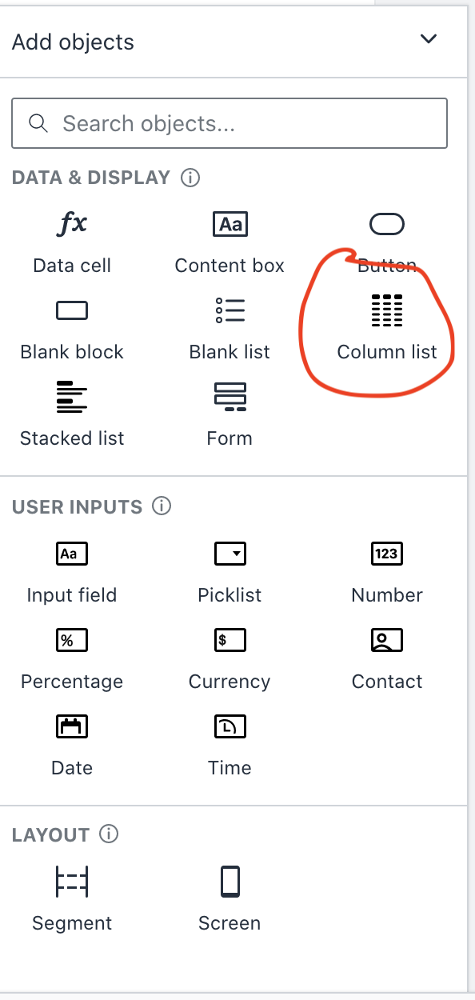

# Create a page to pull ALL data down from the Certification table as a list

We will now build a website which shows certification details for a organisation. 

On the left of the screen, click on the Builder button and under "Apps" click the +

 

A new screen will ask you how you wish to build the app. 

Out of the box you can use the wizard, which is incredibly powerful, and it will create a list of all tables, update tables, delete rows and more. 

However, in this lab we want to show how you do this manually for future builds. We will demonstrate how to have hidden fields and formula's used in the app, and how you can use buttons to activate events. 

Press the "Build from scratch"

You will now see a new screen called **Sceen**. Update as below.

1. Edit the content for the screen currently called "Screen name" by clicking on the "ContentBox" and type in "Certifications". **__NOTE__** Click out of the box - notice it saves the value once you have clicked out - this is how you save in Honeycode.
2. Change the Name of your screen by clicking on the screen list in the Screens bar, right click edit and change its name from "Screen" to Certificaiton. Notice that the screen has a Home symbol - 
3. Lets create a Column List object which will pull the data from the certifications table. Click on the + Add Objects button  This will then provide a range of options for you to build out your page. Notice that these have been split into three catagories, Data & Display; User Inputs; Layout. These will enable you to build out your app based on your needs. 

4. Add in a **List** and assign this to the certification table.  Under the objects click the "Column List". This will bring up a form to define what data to use.  In the **List Source**, click the certifications table in the drop down. In the **Display**, choose the Name, Manager, status and totalcerts, and also click the "Add a detail screen".
Click the create button. 

Notice that there is now a **Certification List** showing the first user in the certification table as the default. Lets now press view app button in the top right corner and see what this looks like. 

This is a new application, fully built and deployed that you can start iterating on, there was no-code you had to write and you can view and share this with your team immidiatly. **Pretty powerful in my opinion.**

**_NOTES:_** There is a Search bar which you can press type in and search for users. 

This is due to the following tick in the list properties under the display button.  Notice this has other options you can also chose in the display. Also click on sort as well in the Display section, and sort the rows on Name and totalcerts.

**_NOTES_** You can click on a user. This is due to when you clicked Add a detailed screen, this creates a New page to show the details for that user. So we now have the basic website to start using and can be shared across your organisation.  

Lets click on a user. You can now see all the details for that user and all the certifications.  Notice that it also has provided a pull down list that you can move to other users as well.  This page is hidden on the main screen as its only available from the main certifications screen. However, you now can see you have 2 screens showing in your App builder, Certification and Certification detail. Click on the sort function and see that this will now sort your data for you with a single tick box. 

### Create a formula that counts all of the certifications in the organisation

 Earlier, a totalcert column with a formula in the Certifcation table was created to show all the certifications per person. I now need to create an ability for showing all certifications in the organisation. 

 To do this on the main page, we need to create a new block above the Block list created.

 Go back to the App Builder and click on the Certification page. 
 Press the Add Objects button and click on the Content box.

 

 In that block type in `Total Certifications In Organisation ` and change the colour to Red.

 Add another object called a Data cell next to the content block. 

 We need to tell that block where it is going to be getting the data from. Click on the block you created with both the content in and the new data cell, click on Data and set this to the certification table. 

 

 Now the block knows what table is associated we can create the formula. 
 
 Add the formula to the data cell  `Set initial value:`  to SUM formula - `=SUM(certifications[totalcerts])`. This will now total that column for total certificates in the table. 

 Click view app and confirm this has worked, there should be a total of 12 certs based on input of the csv file earlier. 

Recap on created items: 
 1. A table called Certification which has 8 users with different certifications, and a total of 12 certifications.
 2. A home page which provides an overview and a sort ability, and functionality to click on each user in the certifications table.  
 3. A certifications detail page, that displays details about a particular user. 

Next is how to create new buttons, creating hidden fields and using buttons on this. [Click here to continue](30_create_functions/README.md)
