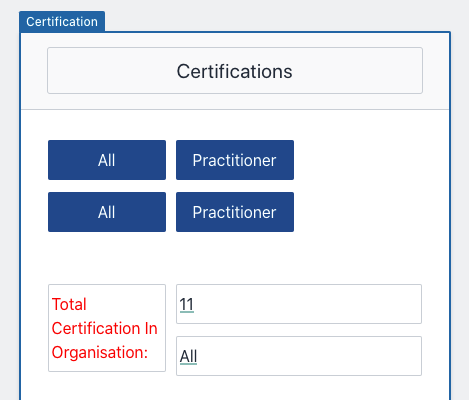
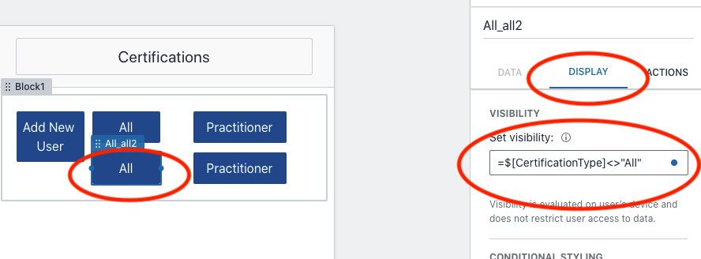

# LAB3 - Buttons, actions and hidden fields

## Automations
Earlier a screen was automatically created to show more details on the certifications.  

## New user form

### Create a button which allows a new insert of a certification user

One of our requirements in this lab is to enable a form to be filled in by our user to create a new user. Lets do this with a button and a new form screen which will allow you to input these details. Go to the Certifications screen in the app builder and click the Add objects button. 

You want to choose blank bock and put that under your certification list,  now add in click button and put that in the blank block just created. 

Change the name from blank button to `Add New User`

We need to create a new screen with this for it to move to. Click on the list and it will provide a new screen choice. Choose this one.

We do not need any new variables, as this is going to create a new user.

That has just created a new screen and it has enabled a quick implementation to update the form. 

We now want to create the new ability to input new users or data.

First of all change the name of new screen to be `Add New User`.

Add a new object here, under Add Objects click on Form in the Data and Display, choose `Form in current session`. We do not need totalcerts as this is a formula, so uncheck this. Keep all the others as and click Create. 

Lets test the form, open it up in the View App.
Notice that you now have a form that now enables inserts for new users for your application. Lets just do a couple of changes, as we want to just provide more detail for each component. 

Lets change the context Box to be more meaningful for a user, rather then calling it PracDate, lets change this to Practioner Date certified, and do this for all the content boxes to be more meaningful as shown below: 

Lets now fix a couple of other requirements here. 
1. Only dates in the past are allowed to be input. 
2. I want to have a capital character for fisrt name and surname.
3. I want a picklist as Y or N in values for certification types. I want status to be Contractor or Permanent.
4. Name, Manager and status must be input before pressing the done button. 
5. Change the certification screen to allow a button to show people with certain certs in a list. 

### 1. Only dates in the past. 
In order to action this, we will create a new hidden conent block which will be shown if a date entered is in the future. 
Under the `$[PractDate Content]` add a new ContentBlock and in there write the following "You have added a value in the future, please check your values."

In the DISPLAY, you will see that =TRUE in the set visibility, change this to this function: 
`=if($[PractDate content] > TODAY(), TRUE, FALSE)`
This is saying that if the practitioner date is greater then today dates, i want the content box to be shown as there data is not as expected, if its not greater then today, then leave this field as hidden. 

Now do the same for all the other date fields, you can do this by cutting and pasting that contentbox and chaning the formula based on which date it is changing. 

### 2. I want to have a capital character for first name and surname in the Name and Manager aspect. We can do this by changing the data in our formula before we save it to the table. 

In the Name field, we want to enforce capital letters for our table, so that on any selections we know it will be sanitised data. 

Click on the Done button at the bottom of the `Add New User` screen. Click on automation --> Edit automation and go to the Name section, here we will add a new formula before it gets inserted into our table. The formula in honeycode to do this is called `PROPER` which does exaclty what we need it to action. In the Take data from, add the below in there `=PROPER($[Name content])`. Do the same on the manager data input which will be `=PROPER($[Manager content])`

### 3. I want a picklist on status, to remove mistyping, i only want Permanent or Contractor here, and i want a picklist only for the certifications to be capital Y or N. 

To create a picklist we will need to create a new table. On the builder, go to tables, and create a new table called `Options`.
In there add two rows, Y and N. We will use this as the picklist.

Highlight all the columns which have Y or N in them one at a time and change their values from Auto to a picklist. Click Formats, and change from Auto to Rowlink and Picklist.

In the Source - choose the new `Options` table you just created. 

Now lets change this on the app.

Go to the Add New User screen, and go to the Practitioner content cell. We are going to change the display format. Click on DISPLAY, and change from Auto to Rowlink and Picklist, in Set source type choose Table, and set the source table to Options. Click out and notice the value has now changed to Y. 

Check that this has worked in the view app, there is now a picklist and no longer a text box. Do this for all of the other columns - Associate Developer; Associate Architect; Associate SysOps.

STATUS needs to provide a picklist for Contractor or Permanent. Create a new table called status.

Create new table called status with two rows, Contractor and Permanent. 

Create a picklist on status in the certification table in the Format. 

Change the app screen Add new user to chose picklist for status. 

Test that this is now working on the view of the app. 

### 4. Name, Manager and status must be input before allowing the done button.

Lets do this one step at a time, and also add a * value to show these are required. 

We can hide the Done button, based off of values on the form. 
In the app builder go to the Add New User screen. Click on the Done button and got to DISPLAY and change from =True to `=IF($[Name content]="",False,True)`.

This is a really great way to hide buttons if an input is not as expected, including regex values. The above says that the DONE button will remain hidden until an input has been put into the `Name Content` has a value in it. 

Test it out under the view app, notice Done has dissappeared, now type in a value in the Name field and tab out, notice Done now appears.

Now we need to do the same for Manager and status in the same view, using the AND function.
In the DISPLAY set visibility to `=AND(IF($[Name content]="",False,True), IF($[Manager content]="",False,True),IF($[status content]="",False,True))` which will enforce a input for all of these values. 

Go to the view app and test that this now requires all 3 fields before the done button becomes unhidden. 

Final part of 4 is to show these fields are mandatory. To do this we create a new content block and on the fields we will put a red star on the details as below: 

View this, and it shows in red. 

### 5. Change the certification screen to allow a button push to show people with certain certs in a list. Rather then creating a new screen per cert type, we can do this with hidden values and hidden buttons. 

Create a new table called Summary, with the following details in: 
|Summary|Totals|
|-------|---------|
|All|All|
|Practitioner|=Filter(certifications,"certifications[Practitioner]=%","Y")|
|ArchAss|=Filter(certifications,"certifications[ArchAss]=%","Y")|
|DevAss|=Filter(certifications,"certifications[DevAss]=%","Y")|
|SysOpsAss|=Filter(certifications,"certifications[SysOpsAss]=%","Y")|

Notice that if you highlight the filter, it shows the associated rows in the other table which we require. 

### Create hidden cell 
Lets create a new data cell function field which we will hide, but use on our application page.

Underneath your "Total Certifications in Organisation" block, add a new function object and call it `CertificationType`. 

In the DATA part of the cell, set it to `=FINDROW(Summary)` this will change the value to be the first row in the Summary table which is our default. Also make sure you set the type to `Variable`

Next set the DISPLAY to =FALSE

Using hidden variables, will enable you to do formula's and using items to support your code like Summary tables. In this case it will enable a uplift of what can be done in the App for doing invisible buttons. 

We now need to show how this will toggle between lists. Create four new buttons, two called `All` and two called `Practitioner`. Note we will do the other certs for this later. 

We will be hiding 1 button and showing 1 button depending on the click of the user, using "Automations" which will then set the summary table details. 

On the top **All** button, go to DISPLAY and in the VISIBILITY set it to `=$[CertificationType]="All"`

On the bottom All button goto DISPLAY and in the VISIBILITY set it to `=$[CertificationType]<>"All"`

The other thing we need to do on the second button is create an action. On the right hand side next to DISPLAY, there is an ACTIONS tab. 
Click on the `Update current screen` as we want to do an update the screen we are in.
Click on the `+ Set variable (1 available)` and click on the `$[CertificationType]` and change `=THISROW()` to `=FINDROW(Summary,"Summary[Summary]=""All""")`

Click on the certification List and set to be  shown if CertificationType is set to ALL.

To do this click on the DISPLAY of the list. This means that the certification list will only be visible if the **CertificationType** is set to ALL. 

We now need to do the same for the practitioner button, so do the same for the two buttons. 
On the top button set VISIBILITY to `=$[CertificationType]="Practitioner"` 

and the bottom Practitioner button set the `=$[CertificationType]<>"Practitioner"`

On the  ACTIONS tab now needs to be set the same way as before. Click on the `Update current screen` as we want to do an update the screen we are in.
Click on the `+ Set variable (1 available)` and click on the `$[CertificationType]` and change `=THISROW()` to update the Practitioner row as shown `=FINDROW(Summary,"Summary[Summary]=""Practitioner""")`

Finally we need to create a new certification list which will be used to be revealed when that button is pressed.

Click on the current certification list, copy it and paste it. 

Click on the DISPLAY of this list and change visibility to `=IF($[CertificationType]="Practitioner",TRUE,FALSE)`

The original list got the data for all rows, we now want to only filter out the practitioner only aspect. Go to the Data tab and add the following there instead - `=FILTER(certifications,"certifications[Practitioner]=""Y""")`

We also need to do the same for the ALL list as well, set the first one to visibility `=IF($[CertificationType]="All",TRUE,FALSE)`

Finally test - open the app and click on All button and all of the list will show. 
Click on the practitioner list, and only the practitioner details will now show. 

If you want to now do this for all the other buttons - SysOps Architect and Developer, copy the certification list and change the Display and buttons as described above, we will not action this here, but you can see the final look below: 

You have completed this section, click on all the buttons, and it should only show in the page the people who have specific lists. 

Lets move on and connect out HoneyCode Application to Slack, [Click here to continue](40_create_SAM_API/README.md)
