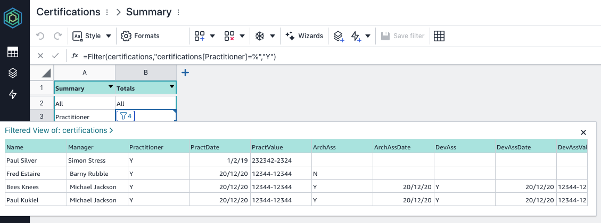
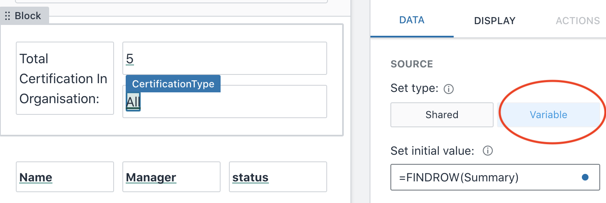
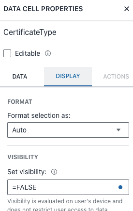
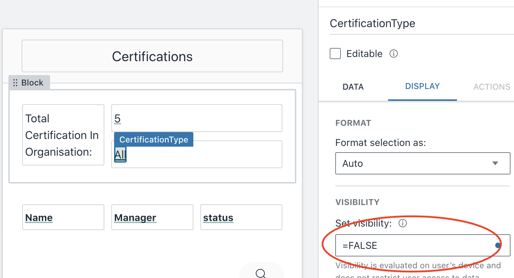

# Buttons, actions and hidden fields

One of the ways we could look at what people are certified in, would be to create a screen per certification table, but there is an alternative to this, where we can create buttons, and have a hidden table we can use instead. 

## Create a hidden table to drive out your formula's in your application

Lets create a summary table which holds all the different, note there are multiple ways to do this, as per the previous formula, but this is another way I think is quite good to have in your toolbelt. 

### Create a new table and insert required details
Create a new table called Summary which has two fields:

|Summary|Certifications|
|-------|---------|
|All|certification|
|Practitioner|=FILTER(Practitioner)|
|Associate Architect|=filter(AssArch)|
|Associate Developer|=filter(AssDev)|
|Associate SysOps|=filter(AssSysOps)|
|DevOps Professional|=filter(DevOpsPro)|
|Architect Professional|=filter(ArchPro)|

This table will be used to pull the data out of the associated tables when buttons are hit.

Lets create a new function field which we will hide, but use on our application page.

Underneath your "Total Certifications in Organisation" block, add a new function object.

Call this "CertificationType" and in the Data component, make sure it is set as a Variable and set the inital value to `=FINDROW(Summary)`. The FINDROW formula description is here: 

The app will look as below: 

Save this and then check it worked in the View App.

Now we want to hide this variable from being seen (note that on the source the Variable button needs to be on). 

Under the DISPLAY element, SET visibility needs to change from `=TRUE` to `=FALSE`

Using hidden variables, will enable you to do formula's and using items to support your code like Summary tables in this case enables a massive uplift of what can be done in the App. 

## Create ability to  new buttons for toggling 
One of the requirements in this project is to show all users with a specific certification. For example, as a user i want to know all the people who have got certified in AWS Practitioner - in this example we will create a new screen in the app to do this. As a user i want to see what  also want to 

### Create a button which then moves to a new screen 
We will show how we can do this in two ways.  create a button which we could move to a new screen, but i like a way to `toggle` through the data and use the on-click of the required button to only show the certifications of the 